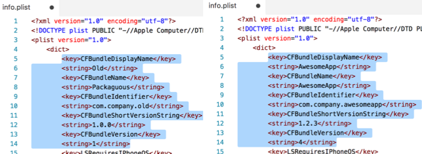

# Mobile.Prerelease

Prepare your mobile release (*BundleId, Name, Version, ...*) from a simple CLI.

## Quickstart



**Updating a manifest**

```bash
> Mobile.Prerelease.exe manifest -f "/my/project/folder" -v "1.2.3.4" -b "com.company.awesomeapp" - n "AwesomeApp"
```

**Updating a configuration file**

```bash
> Mobile.Prerelease.exe configuration -f "/my/project/folder/config.json" -v "Url=https://company.com/api" "LogLevel=Info"
```

## Features

* Updating Android, iOS, UWP manifests
* Auto-search for manifests in subfolders
* Updating simple configuration files (JSON/XML)

## Usage

* command `manifest`
	* `--File` `-f` [*string*] **(required)** : path to the manifest file, or folder that contains manifest file(s). 
	* `--Platform` `-p` [`"iOS"`|`"Android"`|`"Uwp"`] : platform of the given manifest. Is deducted from path if not precised.
	* `--Version` `-v` [`"(Major).(Minor).(Patch).(Build)"`] : the new version number of the application.
	* `--DisplayName` `-n` [*string*] : the new display name of the application.
	* `--BundleIdentifier` `-b` [*string*] : the new bundle identifier of the application.
* command `configuration`
	* `--File` `-f` [*string*] **(required)** : path to the configuration file. 
	* `--Format` `-p` [`"Json"`|`"Xml"`] : dormat of the given configuration file. Is deducted from path if not precised.
	* `--Values` `-v` ["`(Path)=(Value)" "(Path)=(Value)" ...`] : the new values to replace original ones.


## Roadmap / Ideas

* Add annotations to icons

### Contributions

Contributions are welcome! If you find a bug please report it and if you want a feature please report it.

If you want to contribute code please file an issue and create a branch off of the current dev branch and file a pull request.

### License

MIT © [Aloïs Deniel](http://aloisdeniel.github.io)